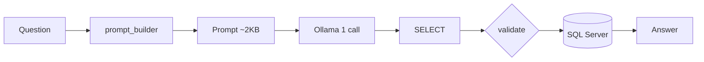

# AskAI Architecture and Knowledge Mapping

> **Maintenance rule:** Keep this file updated whenever AskAI feature code changes.  
> See `.cursor/rules/askai-docs.mdc` for the update checklist.

This document explains how the AskAI feature works in `goodSassDashboard2`: what files are involved, how plant/DB knowledge is mapped, and how queries are processed.

---

## 1) What AskAI Does

AskAI lets users ask natural-language questions about the **PDM SQL Server database** and receive answers in chat UI.

Current implementation:

- **Frontend:** React AskAI page
- **Backend:** FastAPI (AskAI-only endpoints)
- **LLM:** Local Ollama model (`qwen2.5-coder:1.5b`)
- **DB access:** Single-call text2SQL (`OllamaLLM.invoke`) + SQLAlchemy execution

---

## 2) High-Level Flow

```text
User (React AskAI UI)
  -> POST /api/ask-ai/chat
  -> FastAPI main.py
  -> agent.py (text2SQL — one Ollama call)
      -> prompt_builder.py (few-shot + schema linking)
      -> OllamaLLM.invoke → SQL text
      -> SQL Server execute + format rows
  -> Natural-language answer back to UI
```

Health check path:

```text
GET /api/ask-ai/health
  -> config.py (selected Ollama model + DB settings)
  -> ollama_health.py (Ollama /api/tags + /api/ps — installed + loaded state)
  -> db.py (SQL Server connection test)
```

---

## 3) Text2SQL Architecture (CURRENT)

> **One clear rule:** The LLM writes SQL once. FastAPI executes it. No agent loop. No per-question Python routers.

### 3.1 What this is (and is not)

| This project IS | This project is NOT |
| --------------- | ------------------- |
| Single-call text2SQL with domain context | ReAct agent (2–15 LLM calls) |
| YAML few-shot examples when model fails | Growing Python `if question matches X` code |
| Auto schema linking (equipment → table, metric → column) | Full 176-column schema dump |
| FastAPI + SQLAlchemy execution | LangChain running SQL |
| Small local model (`qwen2.5-coder:1.5b`) | 8B+ model requirement |

### 3.2 Pipeline (fixed, never grows)

```text
User question
  -> prompt_builder.py
      -> synonyms.yaml     (equipment/metric words → K1, Feed, Dc1corp)
      -> mappings.yaml     (few_shot SQL examples — edit when LLM fails)
      -> schema snapshot   (shortlist ~20 relevant columns per table)
  -> OllamaLLM.invoke()    (ONE call → SQL text)
  -> validate SELECT + table allowlist
  -> db.execute_select_query()  (SQLAlchemy)
  -> format rows
```



### 3.3 When the LLM gets it wrong

**Do not add Python code.** Add one line to `backend/askai_rules/mappings.yaml` under `few_shot:`:

```yaml
  - question: What is kiln 1 inlet temperature?
    sql: SELECT TOP 1 [DateAndTime], [K1_InletTemp] FROM [Dc1corp] WHERE [K1_InletTemp] IS NOT NULL ORDER BY [DateAndTime] DESC
```

The model learns the pattern from examples. `synonyms.yaml` already maps `kiln 1` → `K1` and `temperature` → `Temp` for schema linking.

### 3.4 Key files

| File | Role |
| ---- | ---- |
| `agent.py` | Orchestrator: LLM invoke → validate → execute |
| `prompt_builder.py` | Builds prompt (few-shot + schema linking) |
| `askai_rules/mappings.yaml` | **few_shot** examples + `default_grain` |
| `askai_rules/synonyms.yaml` | Equipment/metric words, DC group → table |
| `schema_compact.py` | Column list from snapshot (for shortlisting) |
| `db.py` | SQLAlchemy executes SELECT |
| `sql_mssql.py` | Bracket normalization |

### 3.5 Who does what

| Step | Who |
| ---- | --- |
| Generate SQL text | **Ollama** via `OllamaLLM.invoke()` |
| Domain context | YAML + `prompt_builder.py` schema linking |
| Execute SQL | **`db.py` → SQLAlchemy** |
| Format answer | `agent.py` `_format_rows()` |

LangChain `create_sql_query_chain` and V1 `create_sql_agent` are **removed**. No agent tools. No SQL execution inside LangChain.

### 3.5 LangChain API used

```python
from langchain_classic.chains import create_sql_query_chain
from langchain_ollama import OllamaLLM
```

- `**create_sql_query_chain**` — one LLM call; `invoke({"question": "..."})` → raw SQL string
- `**_CompactSchemaDb**` — lightweight stub with `dialect="mssql"` + fixed `table_info` (no `SQLDatabase`)
- **Custom `V2_SQL_PROMPT`** — MS SQL, SELECT-only, SQL output only

### 3.6 Schema strategy

1. **Source:** `backend/schema_reference/db_schema_snapshot.txt` (tab-separated export)
2. **Filter:** Only 24 allowlisted corp/Hour/Day tables from `synonyms.yaml`
3. **Format:** `Dc1corp: DateAndTime, K1_Feed, K1_Current, ...` (names only, no types)
4. **Fallback:** Missing tables loaded once from `INFORMATION_SCHEMA.COLUMNS`
5. **Per-question shrink:** If question contains `Dc1corp`, only that table's columns are sent (~4 KB vs ~107 KB for all 24 tables)

Refresh snapshot after DB changes:

```powershell
C:\WORK\goodSassDashboard2\01_myENV\Scripts\python.exe C:\WORK\goodSassDashboard2\backend\export_schema.py
```

### 3.7 Safety

- `_validate_select_only()` — query must start with `SELECT`
- Blocks `INSERT`, `UPDATE`, `DELETE`, `DROP`, `EXEC`, etc.
- `MAX_QUERY_ROWS` caps rows fetched (default 200)
- DB user should be read-only in production

### 3.8 Example

**Request:**

```cmd
curl -X POST "http://127.0.0.1:8000/api/ask-ai/chat" -H "Content-Type: application/json" -d "{\"question\":\"How many rows in Dc1corp?\"}"
```

**Expected response shape:**

```text
Answer: 12345

SQL: SELECT COUNT(*) AS row_count FROM Dc1corp
```

### 3.9 YAML routing before the prompt (step-by-step)

> **Key idea:** The LLM never reads `synonyms.yaml` or `mappings.yaml` as files. Python loads them, runs deterministic routing, then injects only a **small text slice** into the prompt.

#### What each file is for

| File | Role in Python (before prompt) | What reaches the LLM prompt |
| ---- | ------------------------------ | --------------------------- |
| `synonyms.yaml` | Word → equipment prefix, metric suffix, Dc group → table family, 24-table allowlist | **Results only** — resolved table, column hint, schema shortlist |
| `mappings.yaml` | Time-grain rules, column overrides, hints, few-shot pool | **Hints** (`grain_hint`, `column_hint`, `aggregate_hint`) + up to `few_shot_max` ranked examples |

#### Example question

`Show kiln 2 total production for last 3 years?`

#### `synonyms.yaml` — step by step

| Step | YAML rule used | Result for this question |
| ---- | -------------- | ------------------------ |
| Equipment | `kiln 2` → `equipment_prefix: K2` (longest phrase wins) | **`K2`** |
| Metric | `total production` beats `production` → `column_suffix: TotalProduction` | **`TotalProduction`** |
| Table family | `dc_groups`: `K2` is in **Dc4** → `minute=Dc4corp`, `hour=Dc4Hour`, `day=Dc4Day` | Used after grain is known |
| Allowlist | All tables from `dc_groups` | Only those 24 tables are valid |

**Not used from `synonyms.yaml` for this question:** standalone grain words (`daily`, `hourly`), `routing.default_grain`, `equipment_prefixes` metadata block, `examples` block at file bottom.

#### `mappings.yaml` — step by step

| Step | YAML rule used | Result for this question |
| ---- | -------------- | ------------------------ |
| Time grain | `duration_grain.day` includes `years` → regex on `last 3 years` | **`grain = day`** |
| Table pick | Python: `K2` + `day` → from synonyms `Dc4` group | **`Dc4Day`** |
| Column override | `equipment_column_overrides` (only **RM2** today) | Skipped |
| Column resolve | Fallback: `{equipment}_{suffix}` | **`K2_TotalProduction`** |
| Schema shortlist | Score columns on `Dc4Day` using K2 + TotalProduction + word overlap | **22 columns**, `K2_TotalProduction` near top |
| Prompt hints | `grain_hint`, `column_hint`, `aggregate_hint` | Copied as plain English into prompt |
| Few-shots | All examples in pool ranked by word overlap (`kiln`, `show`, `production`, `last`, `years`…) | Up to **`few_shot_max` (12)** Q→SQL pairs |

#### Produced before `build_text2sql_prompt()` finishes

Intermediate routing (Python only — not shown to the user):

```text
equipment   = K2
suffix      = TotalProduction
grain       = day
tables      = [Dc4Day]
metric_cols = [K2_TotalProduction]
shortlist   = [DateAndTime, K2_TotalProduction, K2_AverageProduction, ...]  # max 22 cols per table
```

What is **inserted into the prompt** (YAML influence as text):

1. Fixed rules (hardcoded in `prompt_builder.py`)
2. Three hint paragraphs from `mappings.yaml`
3. Ranked few-shot examples from `mappings.yaml` (pool is 9 today; cap is 12)
4. Resolved schema slice, for example:

```text
Schema for this question (grain=day):
  [Dc4Day]: [DateAndTime], [K2_TotalProduction], [K2_AverageProduction], ...
Metric columns for this question: [K2_TotalProduction].
```

5. The user question

Typical prompt size for this path: **~3.5 KB (~900 tokens)**.

#### What is **not** pasted into the prompt

- Full `synonyms.yaml` dictionary (51 phrases, 14 equipment entries, 8 Dc groups)
- Full `db_schema_snapshot.txt` (24 tables, **~4,584 columns** — only ~22 shortlisted columns per matched table)
- `metrics.yaml` (not on the main V2 path)
- `build_domain_context()` from `rules_loader.py` (legacy V1 helper; unused in V2)

#### Ambiguity this example exposes

The question says **“total production”** but not **“sum”**.

- YAML correctly maps metric → column **`K2_TotalProduction`**
- Few-shots can conflict:
  - `Show kiln 3 production for last 3 years` → **TOP 200 trend** with `AverageProduction`
  - `Show me sum of kiln 3 production for last 3 years` → **`SUM(TotalProduction)`**

YAML routing picks table and column; the LLM still chooses **trend SQL vs aggregate SQL**. Add or adjust a few-shot when that class of mistake repeats.

#### Why not dump full YAML into the prompt?

You *can* serialize YAML as prompt text — it is a design choice. V2 deliberately does **pre-routing in Python** instead:

| Concern | Why V2 pre-routes |
| ------- | ----------------- |
| Token cost | Full schema + full synonym map is ~100× larger than today’s ~3.5 KB prompt |
| Determinism | Rules like longest-phrase match (`total production` vs `production`) are reliable in Python; small models re-guess badly from raw YAML |
| SQL shape | YAML maps **names**, not T-SQL (`DATEADD`, `SUM` vs `TOP`, brackets). Hints + few-shots teach SQL patterns |
| Hallucination | One table + ~22 columns shrinks search space; “pick from 4,584 columns” increases invented joins/columns |

**Summary:** YAML decides in Python → small focused prompt → LLM writes SQL once. Few-shots are capped (`few_shot_max: 12`) so the pool does not grow into the prompt unless you keep adding examples without a limit.

Functions involved: `match_equipment_prefix`, `match_metric_suffix`, `infer_grain`, `infer_tables_from_question`, `resolve_metric_columns`, `shortlist_columns`, `_few_shot_block` — all in `prompt_builder.py`.

### 3.10 V2 vs V1 comparison


|                        | V1 Agent                    | V2 Chain                 |
| ---------------------- | --------------------------- | ------------------------ |
| LLM calls per question | 2–15                        | **1**                    |
| LangChain entry        | `create_sql_agent`          | `create_sql_query_chain` |
| Schema in prompt       | Full CREATE TABLE + samples | Column names only        |
| Who runs SQL           | Agent tool loop             | FastAPI / `agent.py`     |
| Typical failure        | ReAct parse error           | Bad SQL syntax           |


---

## 4) Version 1 — LangChain Agentic Flow (ARCHIVED)

> **Status:** Replaced by Version 2 (§3). Kept for reference. Do not use `create_sql_agent` for new work.

### 3.1 Approach summary

Version 1 uses **Approach 1** from `DBchatBot.md`: a **LangChain SQL Agent** with a **ReAct loop** (Reason + Act).


| Piece            | Technology                                                                   |
| ---------------- | ---------------------------------------------------------------------------- |
| Orchestration    | LangChain `AgentExecutor` via `create_sql_agent()`                           |
| Agent pattern    | ReAct — `ZERO_SHOT_REACT_DESCRIPTION`                                        |
| LLM              | Local Ollama via `OllamaLLM` (`langchain-ollama`)                            |
| DB layer         | `SQLDatabase` + `SQLDatabaseToolkit` over SQL Server (`pyodbc` / SQLAlchemy) |
| Domain knowledge | YAML injected into agent `prefix` prompt (not vector RAG)                    |
| API surface      | FastAPI `POST /api/ask-ai/chat`                                              |


The model is **not fine-tuned**. It receives:

1. System/safety instructions (`agent.py`)
2. YAML domain context (`rules_loader.py`)
3. Tool descriptions (list tables, read schema, run SQL)
4. Observations returned after each tool call

### 3.2 Installed LangChain packages (project venv)


| Package               | Version (installed) | Role                                                                        |
| --------------------- | ------------------- | --------------------------------------------------------------------------- |
| `langchain`           | 1.3.10              | Core framework                                                              |
| `langchain-community` | 0.4.2               | `create_sql_agent`, `SQLDatabase`, SQL tools                                |
| `langchain-ollama`    | 1.1.0               | `OllamaLLM` — talks to Ollama HTTP API                                      |
| `langchain-classic`   | 1.0.8               | `AgentExecutor`, `AgentType`, `create_react_agent` (pulled in transitively) |
| `sqlalchemy`          | 2.x                 | DB URI / connection pool for LangChain                                      |
| `pyodbc`              | 5.x                 | SQL Server ODBC driver                                                      |


Declared in `backend/requirements.txt`: `langchain`, `langchain-community`, `langchain-ollama` (classic is installed as a dependency of community/classic agents).

### 3.3 Request flow (function-by-function)

```text
POST /api/ask-ai/chat  { "question": "..." }
│
├─ main.py :: ask_ai_chat(payload)
│     └─ get_agent_service().ask(payload.question)
│
├─ agent.py :: get_agent_service()          [@lru_cache singleton]
│     └─ AskAIAgentService(settings)
│
├─ agent.py :: AskAIAgentService.ask(question)
│     ├─ ensure_ready()
│     │     └─ _build_agent()  [first request only — lazy init]
│     └─ _agent.invoke({ "input": question })
│
├─ _build_agent()
│     ├─ OllamaLLM(model, base_url, temperature)     ← Ollama /api/generate or chat
│     ├─ _build_db() → SQLDatabase.from_uri(...)
│     └─ create_sql_agent(
│           llm, db,
│           agent_type=ZERO_SHOT_REACT_DESCRIPTION,
│           prefix=build_system_instructions(),
│           top_k=MAX_QUERY_ROWS,
│           agent_executor_kwargs={ handle_parsing_errors: ... }
│        )
│
├─ build_system_instructions()
│     ├─ SYSTEM_INSTRUCTIONS_BASE  (safety + ReAct workflow rules)
│     └─ build_domain_context()    ← rules_loader.py (YAML → text)
│
├─ _build_db()
│     ├─ get_allowed_tables()      ← 24 corp/Hour/Day tables from synonyms.yaml
│     ├─ settings.sqlalchemy_uri   ← config.py (odbc_connect for named instance)
│     └─ sample_rows_in_table_info=0, max_string_length=300
│
└─ AgentExecutor loop (inside LangChain)
      Thought → Action → Observation → ... → Final Answer
      Returns { "output": "<natural language answer>" }
```

**Health check** (separate path, no agent):

```text
GET /api/ask-ai/health
├─ db.py :: test_db_connection()        [direct pyodbc]
└─ ollama_health.py :: check_ollama_health()  [/api/tags, /api/ps, optional /api/chat probe]
```

### 3.4 LangChain agent internals

`create_sql_agent()` (from `langchain_community.agent_toolkits`) builds:


| Component  | LangChain class / type                  | Purpose                         |
| ---------- | --------------------------------------- | ------------------------------- |
| Toolkit    | `SQLDatabaseToolkit`                    | Bundles SQL tools for the agent |
| Agent      | `RunnableAgent` + `create_react_agent`  | Parses LLM text into tool calls |
| Executor   | `AgentExecutor`                         | Runs the tool loop              |
| Agent type | `AgentType.ZERO_SHOT_REACT_DESCRIPTION` | MRKL / ReAct text format        |


**Tools exposed to the LLM** (names as seen in verbose logs):


| Tool name (Action)     | Underlying class       | What it does                                    |
| ---------------------- | ---------------------- | ----------------------------------------------- |
| `sql_db_list_tables`   | `ListSQLDatabaseTool`  | List allowed table names                        |
| `sql_db_schema`        | `InfoSQLDatabaseTool`  | Return `CREATE TABLE`-style schema for table(s) |
| `sql_db_query`         | `QuerySQLDatabaseTool` | Execute a `SELECT` and return rows              |
| `sql_db_query_checker` | `QuerySQLCheckerTool`  | Optional SQL validation via LLM                 |


**Executor limits (defaults from LangChain):**

- `max_iterations=15` — up to 15 Thought/Action rounds per question
- `early_stopping_method="force"`
- `handle_parsing_errors` — custom hint string in `agent.py` so parse failures retry instead of immediate 500

### 3.5 ReAct loop — how one question runs

For a question like *"How many rows in Dc1corp?"*, the **expected** loop is:

```text
Iteration 1
  Thought:  I need the table structure
  Action:   sql_db_schema
  Action Input: Dc1corp
  Observation: CREATE TABLE [Dc1corp] ( ... 100+ columns ... )

Iteration 2
  Thought:  I can count rows with SQL
  Action:   sql_db_query
  Action Input: SELECT COUNT(*) AS row_count FROM Dc1corp
  Observation: [(12345,)]

Iteration 3
  Thought:  I now know the final answer
  Final Answer: Dc1corp has 12,345 rows.
```

Each **Iteration** = **one Ollama LLM call** + optional DB work.  
Verbose logging (`AGENT_VERBOSE=true`) prints this chain in the **backend terminal**, not in `curl` output. `curl` waits until the full chain completes.

### 3.6 Prompt assembly

```text
┌─────────────────────────────────────────┐
│ prefix: SYSTEM_INSTRUCTIONS_BASE        │
│         + build_domain_context() (YAML) │
├─────────────────────────────────────────┤
│ {tools}  — tool names + descriptions    │
├─────────────────────────────────────────┤
│ FORMAT_INSTRUCTIONS (ReAct template)    │
├─────────────────────────────────────────┤
│ suffix: "Begin! Question: {input}..."   │
└─────────────────────────────────────────┘
```

Key project functions:


| Function                             | File              | Output                                   |
| ------------------------------------ | ----------------- | ---------------------------------------- |
| `build_system_instructions()`        | `agent.py`        | Safety rules + YAML context for `prefix` |
| `build_domain_context()`             | `rules_loader.py` | Compact PDM domain text from YAML        |
| `get_allowed_tables()`               | `rules_loader.py` | 24-table allowlist for `SQLDatabase`     |
| `load_synonyms()` / `load_metrics()` | `rules_loader.py` | Cached YAML loaders                      |


### 3.7 DB connection note (named SQL Server instance)

Health check uses **direct pyodbc** (`config.py :: pyodbc_connection_string`).  
The agent uses **SQLAlchemy** (`config.py :: sqlalchemy_uri`).

For `DB_SERVER=CORP1434-LAP\OPTIMA`, the URI must pass the full ODBC string:

```text
mssql+pyodbc:///?odbc_connect=<url-encoded ODBC connection string>
```

Host-style URLs (`...@CORP1434-LAP%5COPTIMA/PDM`) fail with error 53 even when health check passes.

### 3.8 Known failures (Version 1)

#### Failure A — Output parsing error (model ignores ReAct format)

**Symptom:** HTTP 500, `OUTPUT_PARSING_FAILURE`, LLM returns essay-style text instead of `Thought/Action/Action Input`.

**Example:** Model analyzed sample row values as "temperature/humidity" instead of running `SELECT COUNT(*)`.

**Cause:** `qwen2.5-coder:1.5b` too small to reliably follow MRKL format after large schema context.

**Mitigations applied:**

- `sample_rows_in_table_info=0` (no sample row dump in schema tool)
- `handle_parsing_errors` with format hint in `agent.py`
- Stricter `SYSTEM_INSTRUCTIONS_BASE` workflow text

**Still possible** on complex questions or after long schema observations.

---

#### Failure B — Too slow (primary Version 1 limitation)

**Symptom:** `curl` hangs 2–10+ minutes; backend shows long pause on `sql_db_schema` or between iterations.

**Causes:**


| Factor                            | Impact                                                         |
| --------------------------------- | -------------------------------------------------------------- |
| Model size (`qwen2.5-coder:1.5b`) | Slow inference on CPU/small GPU                                |
| Multiple LLM calls per question   | 2–15 ReAct iterations × Ollama round-trip                      |
| Large schema context              | `Dc1corp` has 100+ columns — huge prompt after `sql_db_schema` |
| Agent cold start                  | First request builds `SQLDatabase` + agent + warms Ollama      |
| 16 GB RAM                         | Model + agent + SQL Server + Windows leaves little headroom    |


**Typical timing (observed in dev):**

- First question: **2–5+ minutes** (often longer on failure/retry)
- Simple `COUNT(*)` ideally 2–3 iterations; weak model may burn more retries

---

#### Failure C — Model cannot keep up with context

**Symptom:** Agent loops, hallucinates, or produces wrong SQL after schema dump.

**Cause:** ReAct prompt grows with each Observation (full `CREATE TABLE` + query results). The 1.5b model **loses track** of required format and task.

**Not a DB bug** — the `CREATE TABLE` text in logs is **read-only schema metadata**, not table creation.

---

#### Failure D — SQL connection mismatch (fixed)

**Symptom:** Health `db_connected: true` but chat fails with pyodbc error 53.

**Cause:** SQLAlchemy host URL vs named instance `CORP1434-LAP\OPTIMA`.

**Fix:** `sqlalchemy_uri` uses `odbc_connect` (see §3.7).

### 3.9 Version 1 verdict


| Criteria                                   | Result                                                                                                                                |
| ------------------------------------------ | ------------------------------------------------------------------------------------------------------------------------------------- |
| Architecture wired (UI → API → agent → DB) | Yes                                                                                                                                   |
| Correct for exploratory / dev testing      | Yes                                                                                                                                   |
| Production-ready on 16 GB + 1.5b model     | **No** — too slow, format errors                                                                                                      |
| Recommended next step                      | **Version 2:** YAML template fast-path + direct SQL for simple queries; larger model or cloud LLM optional for complex agent fallback |


---

## 5) Knowledge Mapping (Core Concept)

AskAI uses **3 knowledge layers**:

### Layer A: Live DB schema (automatic)

LangChain reads table/column info directly from SQL Server at runtime.

- Used by SQL agent to generate queries
- Schema column metadata only (`sample_rows_in_table_info=0` — no sample row dump)
- Limited to allowed tables (see Layer B)

### Layer B: YAML domain rules (curated business knowledge)

Files in `backend/askai_rules/`:

- `synonyms.yaml` -> what words mean in plant/DB terms
- `metrics.yaml` -> approved query templates and starter questions

These files are loaded by `backend/rules_loader.py` and injected into the agent prompt.

### Layer C: Schema snapshot (developer reference)

File:

- `backend/schema_reference/db_schema_snapshot.txt`

Generated by:

- `backend/export_schema.py` running `backend/sqlDBinfo.sql`

Purpose:

- Human-readable full schema export
- Used to improve YAML mappings and synonyms
- **Not automatically read by LLM on every request**

---

## 6) How YAML Knowledge Is Mapped

## 6.1 `synonyms.yaml` (dictionary + routing)

Maps business language to technical structure.

### Table families

- Minute data: `*corp` (example: `Dc1corp`)
- Hourly data: `*Hour` (example: `Dc1Hour`)
- Day data: `*Day` (example: `Dc1Day`)

### Shared time column

- `DateAndTime` in all 3 families

### Column naming pattern

- `<EquipmentPrefix>_<MetricSuffix>`
- Examples: `K1_Current`, `FM1_Feed`, `K2_Speed`

### Equipment prefixes

- `K1`, `K2`, `K3` -> Kilns
- `RM1`, `RM2`, `RM3` -> Raw Mills
- `CM1`, `CM2`, `CM3` -> Cement Mills
- `FM1`..`FM5` -> Finish Mills

### Dc group mapping

Each `Dc` group links equipment prefixes to its 3 tables:

- `Dc1` -> `K1` -> `Dc1corp`, `Dc1Hour`, `Dc1Day`
- `Dc4` -> `K2` -> `Dc4corp`, `Dc4Hour`, `Dc4Day`
- etc.

### Synonyms examples

- `kiln 1` -> `K1`
- `current` / `power` -> column suffix `Current`
- `hourly` -> hour table family
- `daily` -> day table family

---

## 6.2 `metrics.yaml` (approved query templates)

Defines reusable query patterns for common questions:

- `latest_tag_value`
- `tag_trend_by_date`
- `daily_average_metric`
- `compare_two_tags_same_time`

Also includes starter test questions for validation.

> Note: template fast-path execution can be added next; currently templates are included in prompt guidance and future router logic.

---

## 7) How YAML Is Used at Runtime (V2)

**V2 path** (`agent.py` → `prompt_builder.py`):

1. `load_synonyms()` — equipment/metric phrases, Dc groups, allowlist tables
2. `load_mappings()` — grain rules, hints, few-shot pool, column overrides
3. Python routing — table, grain, metric columns, column shortlist (see **§3.9**)
4. `build_text2sql_prompt()` — assembles rules + hints + few-shots + schema slice + question
5. `OllamaLLM.invoke()` — one LLM call

**Not on the V2 main path:**

- `build_domain_context()` in `rules_loader.py` (V1 agent prefix text)
- `metrics.yaml` template fast-path (planned in §13)
- Full `db_schema_snapshot.txt` in the prompt (used only for column lookup via `schema_compact.py`)

See **§3.9** for a full step-by-step walkthrough with a real question.

---

## 8) Is YAML "RAG"?

**Not full RAG.**

- YAML is **structured context injection** (deterministic config/skills)
- Full RAG usually means vector retrieval over documents at query time

Current AskAI approach:

- YAML = curated rules and mappings
- LangChain = live schema + SQL tools
- Ollama = language-to-SQL reasoning

You can add RAG later (embeddings over schema docs), but current setup does not require it.

---

## 9) File-by-File Responsibilities

## Frontend


| File                               | Purpose                                                |
| ---------------------------------- | ------------------------------------------------------ |
| `frontend/src/pages/AskAIPage.tsx` | AskAI chat UI (messages, input, suggestions)           |
| `frontend/src/api/askAi.ts`        | API client for `/api/ask-ai/chat` and `/health`        |
| `frontend/vite.config.ts`          | Dev proxy `/api` -> `http://127.0.0.1:8000`            |
| `frontend/.env`                    | Optional `VITE_API_BASE_URL` for non-proxy deployments |


## Backend API and runtime


| File                        | Purpose                                                               |
| --------------------------- | --------------------------------------------------------------------- |
| `backend/main.py`           | FastAPI app and AskAI endpoints                                       |
| `backend/ollama_health.py`  | Ollama reachability, installed model, and loaded/running model checks |
| `backend/agent.py`          | V2 linear SQL chain (`create_sql_query_chain`) + execute + format     |
| `backend/schema_compact.py` | Stripped schema: table names + column names from snapshot             |
| `backend/config.py`         | Settings loader (`.env`) for DB/Ollama/API                            |
| `backend/db.py`             | SQL Server connection test + schema export helper                     |
| `backend/rules_loader.py`   | Loads YAML and builds domain prompt context                           |
| `backend/requirements.txt`  | Python dependencies                                                   |


## Knowledge and schema files


| File                                              | Purpose                                           |
| ------------------------------------------------- | ------------------------------------------------- |
| `backend/askai_rules/synonyms.yaml`               | Domain dictionary, synonyms, Dc/equipment mapping |
| `backend/askai_rules/metrics.yaml`                | Approved metric templates + starter questions     |
| `backend/sqlDBinfo.sql`                           | SQL script to export schema metadata              |
| `backend/schema_reference/db_schema_snapshot.txt` | Generated schema snapshot for developer reference |
| `backend/export_schema.py`                        | Runs schema export and writes snapshot file       |


## Utility scripts


| File                      | Purpose                                             |
| ------------------------- | --------------------------------------------------- |
| `backend/test_ask_cli.py` | CLI test for `/api/ask-ai/chat`                     |
| `backend/.env`            | Local environment config (DB, Ollama, API settings) |


## Related docs


| File                   | Purpose                                                                 |
| ---------------------- | ----------------------------------------------------------------------- |
| `DBchatBot.md`         | Research notes: LLM SQL agent vs template approach, production patterns |
| `ARCHITECTURE_PLAN.md` | Overall project architecture plan                                       |


---

## 10) Environment Configuration

Primary config file: `backend/.env`

Important keys:

- `DB_SERVER` (example: `CORP1434-LAP\OPTIMA`)
- `DB_NAME` (`PDM`)
- `DB_USER`, `DB_PASSWORD`
- `DB_DRIVER` (`ODBC Driver 17 for SQL Server`)
- `DB_INCLUDE_TABLES` (optional override allowlist)
- `OLLAMA_MODEL` (`qwen2.5-coder:1.5b`)
- `OLLAMA_BASE_URL` (`http://127.0.0.1:11434`)
- `ASKAI_VERBOSE` (`true` by default) — print `[AskAI]` trace lines to the uvicorn CMD window

If `DB_INCLUDE_TABLES` is empty, backend uses allowlist from `synonyms.yaml` (24 tables).

---

## 11) How to Run and Test

### Start Ollama model

```powershell
ollama list
ollama run qwen2.5-coder:1.5b
```

### Start backend

```powershell
C:\WORK\goodSassDashboard2\01_myENV\Scripts\python.exe -m uvicorn main:app --app-dir C:\WORK\goodSassDashboard2\backend --reload --host 127.0.0.1 --port 8000
```

On startup you should see:

```
[AskAI] Verbose CMD logging ON (set ASKAI_VERBOSE=false in backend/.env to disable)
```

### Verbose CMD trace (debugging)

With `ASKAI_VERBOSE=true` in `backend/.env`, every `/api/ask-ai/chat` request prints a step-by-step trace in the **same terminal** where uvicorn runs:

| Log line | Meaning |
| -------- | ------- |
| `QUESTION:` | User question |
| `MAPPINGS:` | Phrase matches from `mappings.yaml` |
| `TABLES:` | Inferred table(s) |
| `PATH: LLM` / `Ollama text2SQL` | Single LLM call (always) |
| `PROMPT SIZE:` / `text2SQL prompt` | Full prompt sent to model |
| `SCHEMA LINK:` | Equipment/metric detected for column shortlist |
| `LLM raw output` | Exact model text before SQL extraction |
| `Validate table allowlist` | Blocks invented table names |
| `DONE: text2sql total=... ms` | Total time |
| `ERROR:` + traceback | On 500/503 when verbose is on |

**Example (template path — row count):**

```
[AskAI] ============================================================
[AskAI] QUESTION: How many rows in Dc1corp?
[AskAI] TABLES: Dc1corp
[AskAI] PATH: TEMPLATE (row_count) - deterministic, no LLM
[AskAI] SQL: SELECT COUNT(*) AS [row_count] FROM [Dc1corp]
[AskAI] >> Validate SELECT-only ...
[AskAI] << Validate SELECT-only OK (0 ms)
[AskAI] >> Execute SQL (SQLAlchemy) ...
[AskAI] << Execute SQL (SQLAlchemy) OK (501 ms)
[AskAI] RESULT: 1 row(s), columns=['row_count']
[AskAI] DONE: path=template total=542 ms
[AskAI] ============================================================
```

Use this to spot wrong SQL or slow LLM steps. When the model fails, add a **few_shot** example to `mappings.yaml` — do not add Python code.

### Health check

`GET http://127.0.0.1:8000/api/ask-ai/health`

Returns API, database, and Ollama status in one call. Use this before testing chat.

**Example response (model ready via interactive `ollama run` but `ollama ps` empty):**

```json
{
  "status": "ok",
  "ollama_model": "qwen2.5-coder:1.5b",
  "ollama_base_url": "http://127.0.0.1:11434",
  "ollama_connected": true,
  "ollama_model_installed": true,
  "ollama_model_loaded": true,
  "ollama_running_models": [],
  "ollama_message": "Model 'qwen2.5-coder:1.5b' is ready via Ollama HTTP API. Model responded to HTTP API probe. (ps was empty — common with interactive `ollama run`.)",
  "db_configured": true,
  "db_connected": true,
  "db_message": "Connected to PDM on CORP1434-LAP\\OPTIMA",
  "message": "AskAI API is running. Use /api/ask-ai/chat for questions."
}
```

**Example response (model not installed / not running):**

```json
{
  "status": "ok",
  "ollama_model": "qwen2.5-coder:1.5b",
  "ollama_connected": true,
  "ollama_model_installed": true,
  "ollama_model_loaded": false,
  "ollama_running_models": [],
  "ollama_message": "Model 'qwen2.5-coder:1.5b' is installed but not loaded (ollama ps is empty). Run: ollama run qwen2.5-coder:1.5b",
  "db_configured": true,
  "db_connected": true
}
```

**Field guide:**


| Field                    | Meaning                                                                                  |
| ------------------------ | ---------------------------------------------------------------------------------------- |
| `status`                 | FastAPI process is up (`ok`)                                                             |
| `ollama_model`           | Model name from `OLLAMA_MODEL` in `backend/.env`                                         |
| `ollama_base_url`        | Ollama URL from `OLLAMA_BASE_URL`                                                        |
| `ollama_connected`       | Ollama HTTP API reachable                                                                |
| `ollama_model_installed` | Selected model appears in `ollama list` (`/api/tags`)                                    |
| `ollama_model_loaded`    | Model ready for AskAI: in `ollama ps` **or** responds to a tiny `/api/chat` probe        |
| `ollama_running_models`  | Names from `/api/ps` (may be empty even when model responds in interactive `ollama run`) |
| `ollama_message`         | Human-readable Ollama status + fix hint                                                  |
| `db_configured`          | DB credentials set in `.env` (not placeholder values)                                    |
| `db_connected`           | Live SQL Server connection test passed                                                   |
| `db_message`             | DB connection result detail                                                              |


**Quick CLI equivalents:**

```powershell
# Selected model (from backend/.env)
# OLLAMA_MODEL=qwen2.5-coder:1.5b

ollama list          # installed models  -> ollama_model_installed
ollama ps            # in-memory models    -> ollama_running_models (may be empty during interactive run)

# Load / warm the selected model before chat:
ollama run qwen2.5-coder:1.5b
```

**Note:** Interactive `ollama run` can work in the terminal while `ollama ps` stays empty. The health check handles this by probing `/api/chat` when `/api/ps` is empty but the model is installed.

Chat requires `ollama_connected`, `ollama_model_installed`, and `ollama_model_loaded` all `true`, plus `db_connected` `true`.

### CLI chat test

```powershell
C:\WORK\goodSassDashboard2\01_myENV\Scripts\python.exe C:\WORK\goodSassDashboard2\backend\test_ask_cli.py "Show latest kiln 1 current from minute data"
```

### Refresh schema snapshot

```powershell
C:\WORK\goodSassDashboard2\01_myENV\Scripts\python.exe C:\WORK\goodSassDashboard2\backend\export_schema.py
```

---

## 12) Recommended Query Improvement Workflow

1. Run `export_schema.py` after DB changes
2. Review `db_schema_snapshot.txt`
3. Update `synonyms.yaml` (new tags, synonyms, Dc mappings)
4. Update `metrics.yaml` (new common business questions)
5. Test with `test_ask_cli.py`
6. Validate in React AskAI UI

This gives better accuracy without model training.

---

## 13) Current Limits and Next Steps

### Version 2 (current — linear SQL chain)

See **§3**.

Summary:

- One LLM call per question (no ReAct loop)
- Compact schema from snapshot; per-table filter when table name is in question
- FastAPI executes and returns row data + SQL echo
- Still limited by small model quality on complex joins / vague questions

### Version 3 (planned)

1. **Template fast-path router** — `metrics.yaml` pattern match → run SQL with zero LLM
2. **YAML synonym table router** — map "kiln 1 current" → `Dc1corp.K1_Current` without full schema
3. Query validator hardening, audit logs, row-level security

### Version 1 (archived)

Documented in **§4**. Replaced due to slow ReAct loop and parse failures on `qwen2.5-coder:1.5b`.

---

## 14) Quick FAQ

### Does LLM read `db_schema_snapshot.txt` directly?

No. V2 uses it via `schema_compact.py` to **shortlist ~22 columns per matched table** in the prompt. The full snapshot is a developer reference; it is not dumped into every prompt.

### Why use YAML if LLM already knows SQL?

YAML reduces guessing, improves speed, and makes results more consistent in large schemas.

### Can this run offline on LAN?

Yes. Frontend + FastAPI + Ollama + local SQL Server can run without internet (after packages/models are installed).